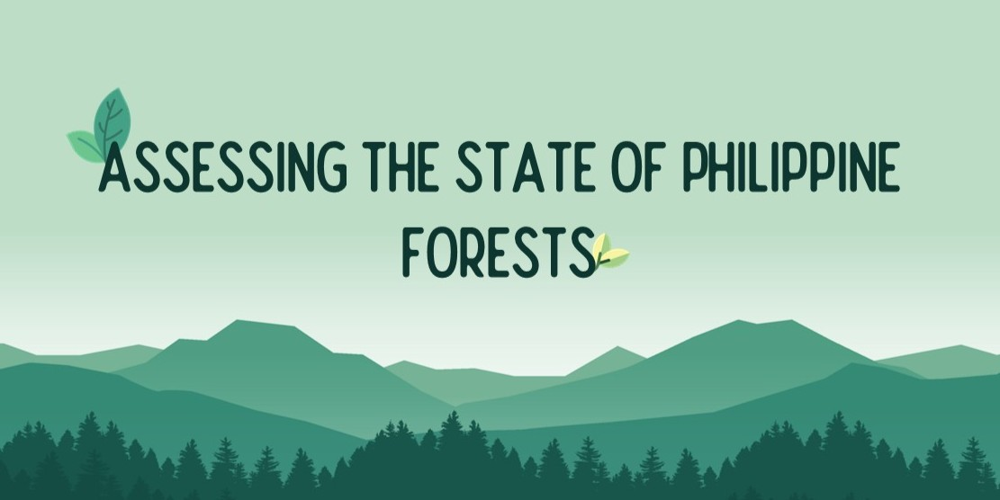

# Vince Joshua Senon — Portfolio

Personal portfolio site built with HTML, CSS, and vanilla JavaScript.  
Live at: [vince-senon.github.io/myPortfolio](https://vince-senon.github.io/myPortfolio)

---

## 📁 Folder Structure

```
myPortfolio/
├── index.html              # Main page
├── css/
│   └── style.css           # All styles
├── js/
│   └── main.js             # Theme toggle + project slider
├── assets/
│   └── resume.pdf          # ← Upload your CV here to enable Download CV button
│   └── project-forest.jpg  # ← Optional: project thumbnail images
│   └── project-commute.jpg
├── photo.JPG               # Profile photo
└── README.md
```

---

## ✏️ How to Update Common Things

### Add / update your CV
1. Export your resume as a PDF
2. Name it `resume.pdf`
3. Place it in the `assets/` folder
4. Push to GitHub — the Download CV button will work automatically

### Add a project image
1. Place your image in `assets/` (e.g. `assets/project-forest.jpg`)
2. In `index.html`, find the project card and replace the placeholder block:
```html
<div class="project-thumb-placeholder">...</div>
```
with:
```html

```

### Change a project from WIP to Ready
In `index.html`, find the project's badge and replace:
```html
<span class="badge badge-wip"><span class="badge-dot"></span> Work in Progress</span>
```
with:
```html
<span class="badge badge-ready"><span class="badge-dot"></span> Available</span>
```

### Add a new project
Copy an existing `.project-card` block inside `projects-track` in `index.html` and update the content. The slider handles multiple cards automatically.

---

## 🚀 Deploy
Push any changes to the `main` branch — GitHub Pages auto-deploys within ~60 seconds.
